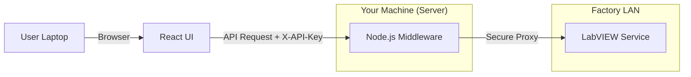

# Connectivity & Security Guide: Nexus Dashboard

This guide explains how the different parts of the Nexus Dashboard talk to each other and how to troubleshoot connection issues on-site.

---

## 🏗️ 1. High-Level Architecture
The application works in a **Three-Layered** setup:

1.  **Frontend (The UI)**: Runs in the user's browser (Chrome/Edge).
2.  **Middleware (Node.js Server)**: Acts as a "Security Guard" and "Translator".
3.  **Data Source (LabVIEW)**: The machine/PC running the actual production logic.

---

## 🔗 2. Connection Settings (Where to look)

### **A. Local Machine Setup (Dev Mode)**
When you run everything on your own laptop:
- **Frontend URL**: `http://localhost:5173`
- **Backend URL**: `http://localhost:5000`
- **Communication**: Everything happens inside your machine.

### **B. Distributed Setup (On-Site)**
When the Dashboard is accessed from another machine:
- **Server IP**: `192.168.1.7` (Example)
- **Frontend URL**: `http://192.168.1.7:5173`
- **Backend URL**: `http://192.168.1.7:5000`

---

## 🛡️ 3. Security Flow (The "Security Guard")

### **Why we use the Node.js Middleware?**
Most LabVIEW web services don't have built-in security. If we connected the UI directly to LabVIEW, anyone on the network could steal production data.

**The Solution:**
1.  **Node.js acts as a Proxy**: The UI *never* talks to LabVIEW directly. It only talks to Node.js.
2.  **API Keys**: Node.js requires a "Membership Card" (`X-API-Key`) from the UI.
3.  **CORS Control**: Node.js only allows specific machines (IPs) to ask for data. 
4.  **Protection**: Even if LabVIEW has no security, the Node.js layer keeps it safe behind the factory LAN.

---

## 📂 4. Configuration Files

| File | Variable | Purpose |
| :--- | :--- | :--- |
| **`server/.env`** | `LABVIEW_API_URL` | The real address of the LabVIEW machine. |
| | `CORS_ORIGIN` | Which devices are allowed to see the UI. |
| | `AUTH_DISABLED` | Set to `true` to turn off all security for testing. |
| **`plant-dashboard/.env`** | `VITE_API_BASE_URL` | Points the UI to the Node.js server IP. |

---

## 🛠️ 5. Tech Support Troubleshooting (On-Site)

If the UI shows **"FAILED TO FETCH DATA"**, check these in order:

1.  **Ping Test**: From the User PC, try to ping the Server PC (`ping 192.168.1.7`).
2.  **Firewall**: Ensure Ports **5000** (Backend) and **5173** (Frontend) are open on the Server PC.
3.  **Environment Sync**: Ensure `VITE_API_BASE_URL` in the frontend `.env` matches the ACTUAL IP of the server.
4.  **LabVIEW Status**: Open the `LABVIEW_API_URL` directly in a browser. If it doesn't return JSON, the LabVIEW machine is down.
5.  **Logs**: Check the Node.js terminal for `🔒 Authentication failed` or `🚫 CORS blocked` messages.

---

## 🧪 6. Testing Mode
If you are struggling with connectivity and want to "just see the data," enable **Permissive Mode**:
1.  Open `server/.env`.
2.  Set `AUTH_DISABLED=true`.
3.  Set `CORS_DEV_MODE=true`.
4.  Restart the server.
*Note: Only use this for troubleshooting!*
