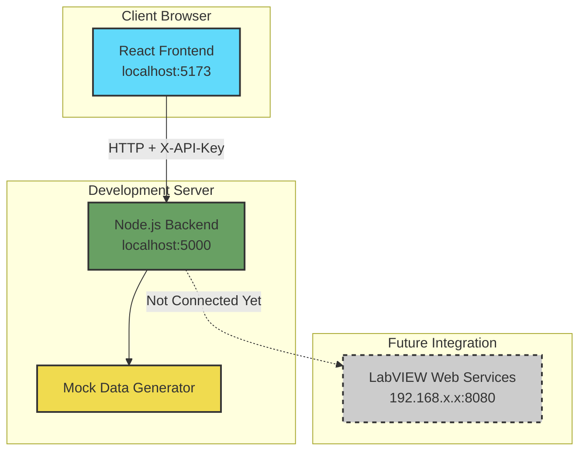
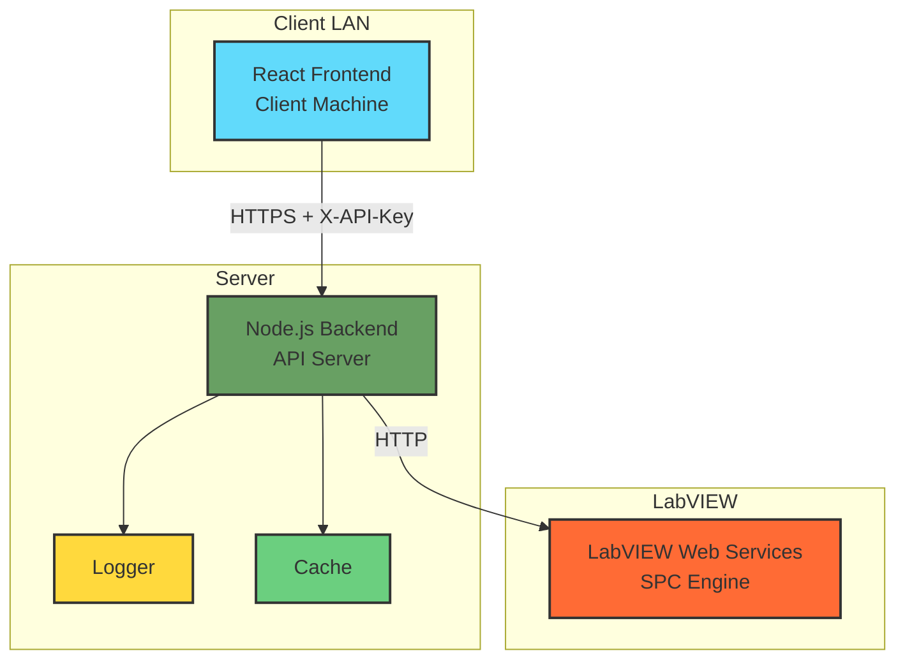

# Project Status Summary - Stage 1.5

**Generated**: 2026-02-11 12:40  
**Current Stage**: Stage 1.5 (LAN-Hardened Deployment)  
**Completion**: 90%

---

## 📊 Current Project State

### **What's Working Right Now**

```
✅ Frontend (React)
   ├── Production Dashboard with station cards
   ├── SPC Dashboard with control charts
   ├── Filter system (Plant, Line, Station, Shift, Date)
   ├── Auto-refresh every 10 seconds
   └── API key authentication headers

✅ Backend (Node.js)
   ├── Express API server running on port 5000
   ├── Mock data API endpoints
   ├── API key authentication middleware
   ├── CORS restrictions for LAN IPs
   ├── Input validation and sanitization
   └── Test suites for all security features

✅ Security & Monitoring Features
   ├── API key generation utility
   ├── Authentication on all /api/* routes
   ├── CORS whitelist for allowed origins
   ├── Input validation for query parameters
   ├── Winston logger with daily rotation
   └── Test scripts for all security & logging features
```

### **What's In Progress**

```
⏳ LabVIEW Integration
   ├── LabVIEW service client (not started)
   ├── API proxy layer (not started)
   ├── Data transformation (not started)
   └── Error handling for LabVIEW downtime (not started)

⏳ Performance & Resilience
   ├── Response caching (not started)
   └── Deployment documentation (not started)
```

---

## 🏗️ Architecture Overview

### **Current Architecture (Stage 1.5)**



### **Target Architecture (After LabVIEW Integration)**



---

## 📁 File Structure Snapshot

```
PlantProductionDashboard/
│
├── 📱 FRONTEND (React + Vite)
│   ├── src/
│   │   ├── components/
│   │   │   ├── dashboard/
│   │   │   │   ├── ProductionDashboard.jsx  ✅ Main dashboard
│   │   │   │   └── SPCDashboard.jsx         ✅ SPC analytics
│   │   │   ├── filters/FilterPanel.jsx      ✅ Filter controls
│   │   │   ├── cards/StationCard.jsx        ✅ Station cards
│   │   │   └── charts/SPCChart.jsx          ✅ Control charts
│   │   ├── services/
│   │   │   └── apiService.js                ✅ API client (with auth)
│   │   ├── hooks/
│   │   │   ├── useApi.js                    ✅ API hook
│   │   │   └── usePolling.js                ✅ 10s polling
│   │   └── context/
│   │       └── FilterContext.jsx            ✅ Filter state
│   │
├── 🖥️ BACKEND (Node.js + Express)
│   ├── server/
│   │   ├── config/
│   │   │   └── logger.js                    ✅ Winston logger
│   │   ├── middleware/
│   │   │   ├── auth.js                      ✅ API key auth
│   │   │   ├── cors.js                      ✅ CORS config
│   │   │   ├── validation.js                ✅ Input validation
│   │   │   └── errorHandler.js              ✅ Error handling
│   │   ├── routes/
│   │   │   └── api.routes.js                ✅ API endpoints
│   │   ├── services/
│   │   │   ├── mockDataGenerator.js         ✅ Mock data
│   │   │   └── labviewService.js            ⏳ LabVIEW client
│   │   ├── utils/
│   │   │   └── cache.js                     ⏳ Caching
│   │   ├── server.js                        ✅ Express server
│   │   ├── generate-api-key.js              ✅ Key generator
│   │   ├── test-auth.js                     ✅ Auth tests
│   │   ├── test-cors.js                     ✅ CORS tests
│   │   ├── test-logging.js                  ✅ Logging tests
│   │   └── test-validation.js               ✅ Validation tests
│   │
└── 📚 DOCUMENTATION (Meta/)
    ├── DEVELOPMENT_ROADMAP.md               ✅ This roadmap
    ├── STAGE1_README.md                     ✅ Stage 1 docs
    ├── STAGE1.5_AUTHENTICATION_EXPLAINED.md ✅ Auth guide
    ├── STAGE1.5_CORS_EXPLAINED.md           ✅ CORS guide
    ├── STAGE1.5_VALIDATION_EXPLAINED.md     ✅ Validation guide
    ├── STAGE1.5_ENVIRONMENT_SETUP_EXPLAINED.md ✅ Env setup
    └── Database_Dashboard_Analysis.md       ✅ DB analysis
```

---

## 🔐 Security Status

| Feature | Status | Notes |
|---------|--------|-------|
| **API Key Authentication** | ✅ Complete | All `/api/*` routes protected |
| **CORS Restrictions** | ✅ Complete | LAN IP whitelist configured |
| **Input Validation** | ✅ Complete | Query params sanitized |
| **Request Logging** | ✅ Complete | Winston logger with rotation |
| **Rate Limiting** | ❌ Not Planned | Stage 2 feature |
| **HTTPS/TLS** | ❌ Not Planned | Stage 2 feature |
| **User Auth (JWT)** | ❌ Not Planned | Stage 2 feature |

---

## 🎯 Remaining Tasks for Stage 1.5

### **High Priority** (This Week)
1. ⏳ Create LabVIEW service client
   - File: `server/services/labviewService.js`
   - HTTP client for LabVIEW API
   - Error handling and retries

2. ⏳ Update API routes to use LabVIEW
   - File: `server/routes/api.routes.js`
   - Replace mock data with LabVIEW calls
   - Add data transformation layer

3. ⏳ Implement response caching
   - File: `server/utils/cache.js`
   - 5-minute TTL for LabVIEW responses
   - Fallback when LabVIEW is down

### **Medium Priority** (Next Week)
5. 📋 End-to-end testing with LabVIEW data
6. 📋 Create deployment documentation
7. 📋 Client handoff guide
8. 📋 Production build testing

### **Low Priority** (Before Deployment)
9. 📋 Performance optimization
10. 📋 UI polish and bug fixes

---

## 🚀 Deployment Timeline

```
Week 1 (Current)     Week 2              Week 3-4           Week 5+
─────────────────────────────────────────────────────────────────
Stage 1.5 Dev    │   Client Pilot   │   Monitoring    │  Stage 2
                 │                  │                 │  Planning
✅ Auth          │   📋 Deploy      │   📋 Feedback   │
✅ CORS          │   📋 Monitor     │   📋 Bug Fixes  │
✅ Validation    │   📋 Support     │   📋 Optimize   │
⏳ LabVIEW       │                  │                 │
⏳ Logging       │                  │                 │
```

---

## 📝 Quick Reference

### **Running the Project**

```bash
# Backend (Terminal 1)
cd server
npm run dev
# Server runs on http://localhost:5000

# Frontend (Terminal 2)
cd PlantProductionDashboard
npm run dev
# Frontend runs on http://localhost:5173
```

### **Testing Security**

```bash
# Generate API key
node server/generate-api-key.js

# Test authentication
node server/test-auth.js

# Test CORS
node server/test-cors.js

# Test validation
node server/test-validation.js
```

### **Environment Variables**

```bash
# server/.env
NODE_ENV=development
PORT=5000
API_KEY=<your-generated-key>
ALLOWED_API_KEYS=<key1>,<key2>
CORS_ORIGIN=http://localhost:5173
LABVIEW_API_URL=http://192.168.x.x:8080  # To be configured
```

```bash
# .env (frontend)
VITE_API_BASE_URL=http://localhost:5000
VITE_API_KEY=<same-as-backend-api-key>
```

---

## 🔄 Git Status

**Current Branch**: `stage-1/react-visualizer-api`  
**Remote**: `origin/stage-1/react-visualizer-api`  
**Status**: Up to date with remote

**Uncommitted Changes**:
- `src/components/dashboard/SPCDashboard.jsx` (modified)

**Merge to Main**: ❌ Not recommended until Stage 2 is complete

---

## 📞 Next Steps

1. **Complete LabVIEW integration** (2-3 days)
2. **Test with real LabVIEW data** (1 day)
3. **Deploy to client LAN** (1 day)
4. **Monitor and collect feedback** (1-2 weeks)
5. **Plan Stage 2 upgrade** (after pilot success)

---

**For detailed information, see**: `Meta/DEVELOPMENT_ROADMAP.md`
