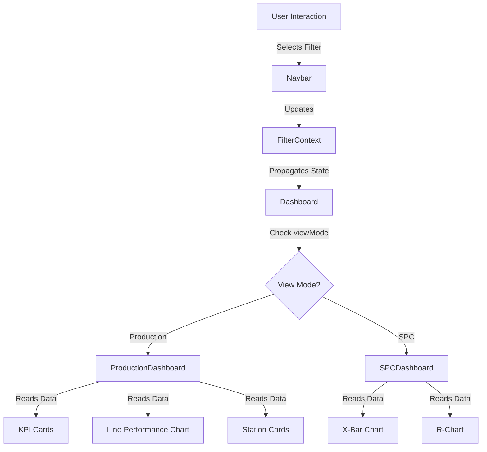

# Nexus SPC & Production Intelligence Dashboard - Project Flow

## 1. High-Level Architecture
This project is a React-based Single Page Application (SPA) built with Vite. It uses a **Global Filter Context** to drive all data visualizations, ensuring that every chart and KPI responds immediately to user selection of Plant, Line, Station, Shift, or Date.

### Core Technologies
- **Framework**: React 19 + Vite
- **Styling**: Tailwind CSS + shadcn/ui
- **State Management**: React Context API (`FilterContext`)
- **Visualization**: Recharts
- **Routing**: React Router 6

---

## 2. File Structure & Responsibilities

### `src/` Root
| File/Folder | Responsibility |
|---|---|
| `main.jsx` | Entry point. Wraps the app in `Strict Mode` and **`FilterProvider`** to ensure global state access. |
| `App.jsx` | Defines routes (`/` for Dashboard, `/station/:id` for Analytics). Wraps routes in `Layout`. |
| `index.css` | Global styles and Tailwind directives. |

### `src/context/`
| File | Responsibility |
|---|---|
| **`FilterContext.jsx`** | **The Brain.** Holds the global state (`plant`, `line`, `station`, `shift`, `dateRange`, `viewMode`). Exports `useFilters()` hook for components to read/update state. |

### `src/components/layout/`
| File | Responsibility |
|---|---|
| `Layout.jsx` | Main shell. Contains `Sidebar`, `Navbar`, and the main content area. |
| `Navbar.jsx` | Contains the **Global Filter Bar**. reading cascading data (Plant -> Line -> Station) and updating `FilterContext`. |
| `Sidebar.jsx` | Navigation menu (currently static). |

### `src/pages/`
| File | Responsibility |
|---|---|
| **`Dashboard.jsx`** | The main landing page. **Logic Switcher**: Decides whether to render `<ProductionDashboard />` or `<SPCDashboard />` based on `filters.viewMode`. |
| `StationAnalytics.jsx` | Detailed view for a specific station. Supports Graph, Table, and SPC views locally. |

### `src/components/dashboard/`
| File | Responsibility |
|---|---|
| `ProductionDashboard.jsx` | **View A**: Displays operational KPIs (Output, OEE, Rejection) and the Line Performance Chart. |
| `SPCDashboard.jsx` | **View B**: Displays Statistical Process Control charts (X-Bar, R-Chart) and violation alerts. |

### `src/components/charts/`
| File | Responsibility |
|---|---|
| `ControlChart.jsx` | Reusable Recharts component for SPC charts. Renders Mean/Range lines, Control Limits (UCL, LCL, CL), and tooltips. |

### `src/lib/`
| File | Responsibility |
|---|---|
| `data.js` | **Mock Data Source**. Contains static arrays for `PLANTS`, `LINES`, `STATIONS` and mock datasets for KPIs and SPC. Simulates a database response. |
| `utils.js` | Helper functions (mainly `cn` for Tailwind class merging). |

---

## 3. Data Flow Diagram

The application uses a **Top-Down Unidirectional flow**, triggered by the Context.

---

## 4. Visual Logic Breakdown

### A. Production Graphs (Performance)
- **Goal**: Show volume and speed.
- **Component**: `ProductionDashboard.jsx` -> `LinePerformanceChart`
- **Logic**:
    - Uses `AreaChart` to show accumulated output over time.
    - Compares Actual Output (Gradient Fill) vs Target (Dotted Line).
    - Data Source: `LINE_GRAPH_DATA` (mock).

### B. SPC Graphs (Quality Control)
- **Goal**: Show stability and variation.
- **Component**: `SPCDashboard.jsx` -> `ControlChart`
- **Logic**:
    - Uses `LineChart` to plot individual sample points.
    - **Reference Lines**: Crucial for SPC.
        - **UCL (Upper Control Limit)**: Red Dashed Line
        - **LCL (Lower Control Limit)**: Red Dashed Line
        - **CL (Center Line)**: Gray Solid Line
    - **Interpretation**: Points outside UCL/LCL indicate process instability.

---

## 5. How to Extend
1.  **Add a new filter**:
    - Update `FilterContext.jsx` initial state.
    - Add `<Select>` in `Navbar.jsx`.
2.  **Connect to Real API**:
    - Replace `src/lib/data.js` imports with `useEffect` calls to your API.
    - Update `FilterContext` to fetch data when filters change.
