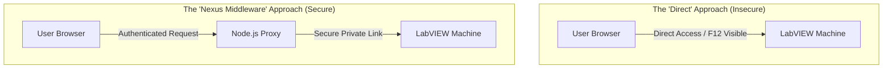

# Architecture Battle: Direct Fetch vs. Middleware Proxy

Let's compare your proposed "Direct" approach vs. the "Nexus Middleware" approach to see where the loopholes live.

## 🛰️ Architecture Comparison

### Option A: The "Direct" Approach
**Flow**: React Browser `-->` LabVIEW API

**The Loophole: "The Inspect Element Theft"**
Because React runs in the user's browser, EVERYTHING is visible.
1. A user presses **F12**.
2. They look at the **Network** tab.
3. They see the exact IP and Port of your LabVIEW machine.
4. Now they can use Python or even a simple browser tab to spam requests to LabVIEW, potentially crashing the machine that is controlling your production line.
5. **Security Level**: 🔴 Weak (Low protection).

---

### Option B: The "Nexus Middleware" (Current)
**Flow**: React Browser `-->` **Node.js Proxy** `-->` LabVIEW API

**The Shield: "The Trust Buffer"**
1. The user's browser **never knows** the LabVIEW IP. It only sees your Node server IP.
2. The Node.js server sits on a machine that has a "Firewall Rule" (The Door).
3. Even if the user presses F12, they only see the Node.js address.
4. Node.js checks the `X-API-Key`. If it's wrong, it kills the request instantly—**LabVIEW never even hears the noise.**
5. **Security Level**: 🟢 Strong (Professional standard).

## ⚔️ The Comparison

| Feature | Direct (Loopholes) | Middleware (Authenticated) |
| :--- | :--- | :--- |
| **Secret Protection** | **FAIL**: Keys are visible in Browser DevTools. | **WIN**: Keys are hidden on the Server. |
| **CORS Issues** | **FAIL**: LabVIEW often blocks browser requests. | **WIN**: Node.js handles CORS perfectly. |
| **Traffic Control** | **FAIL**: Anyone can spam the LabVIEW machine. | **WIN**: Node.js can limit requests (Rate Limiting). |
| **Data Cleaning** | **FAIL**: Browser has to process raw, heavy data. | **WIN**: Node.js cleans data before sending. |
| **LabVIEW Load** | **HIGH**: Every user hits LabVIEW directly. | **LOW**: Node.js can **Cache** data (1 hit for 10 users). |

## 🏁 The Verdict
Your Direct approach is easier to build (1 less file), but it leaves your **Industrial Equipment (LabVIEW)** exposed to anyone with a browser. 

The Middleware architecture isn't just about security; it's about **Stability**. By putting Node.js in the middle, we ensure that no matter how many people open the dashboard, the LabVIEW machine stays calm, protected, and focused on production.
