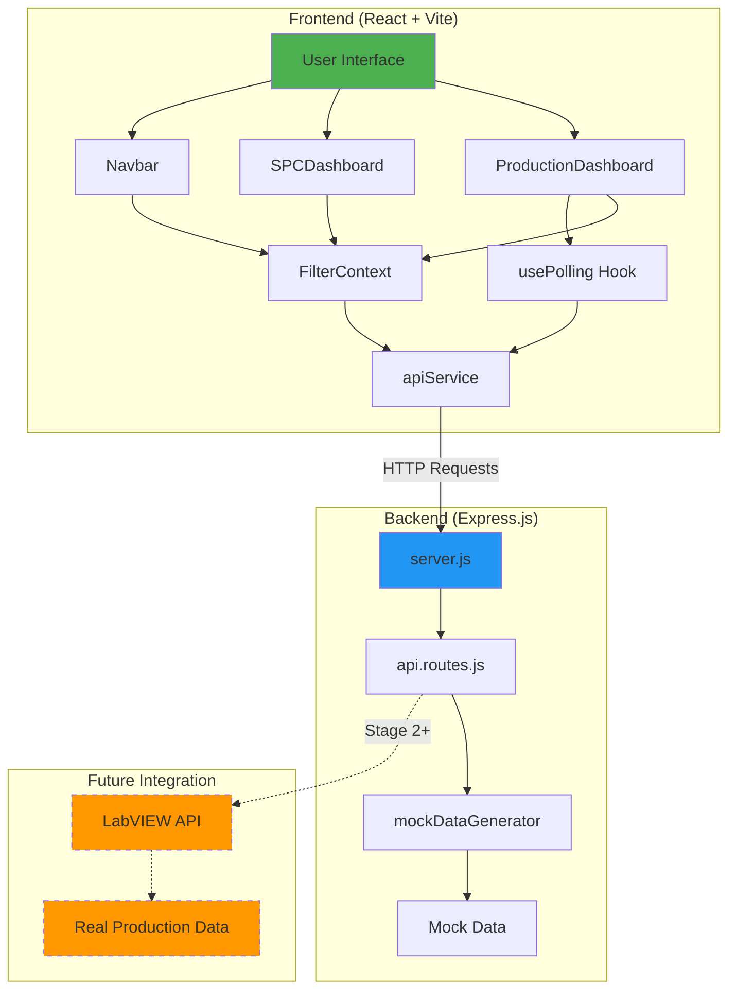
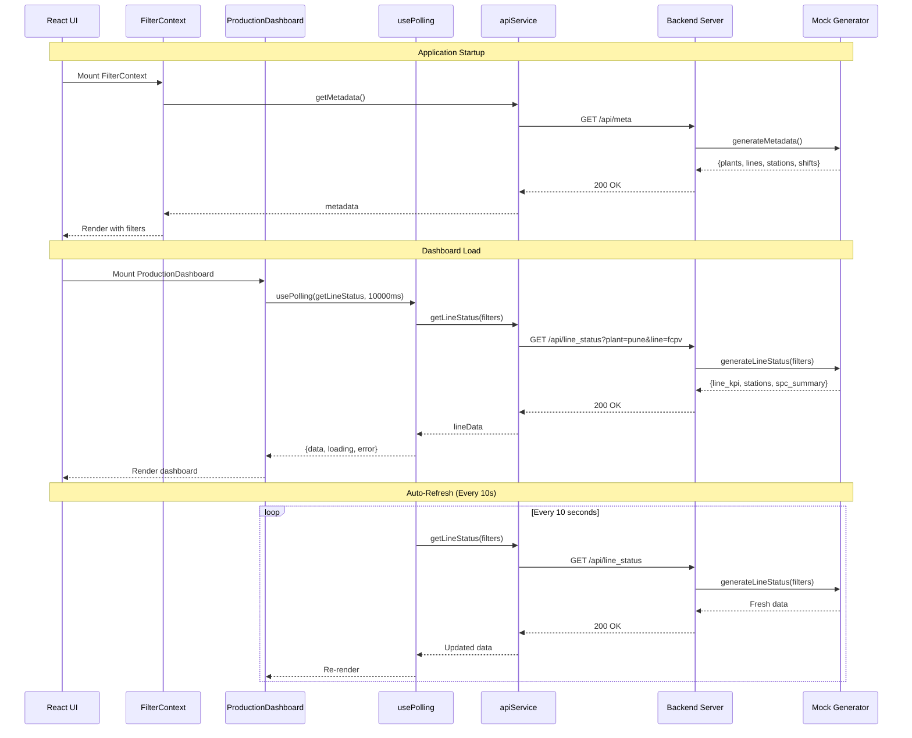

# Stage 1: React Visualizer with LabVIEW-Exposed API

## 📋 Executive Summary

This branch represents **Stage 1** of the Plant Production Dashboard development, where the React frontend has been transformed from using static mock data to consuming dynamic data from a backend API server. While currently using mock data generators, this architecture is designed to seamlessly integrate with real LabVIEW-exposed APIs in future stages.

### Key Achievements
- ✅ **Backend API Server**: Complete Express.js server with RESTful endpoints
- ✅ **Dynamic Data Flow**: React components now fetch data from API instead of static imports
- ✅ **Real-time Updates**: Polling mechanism for automatic data refresh every 10 seconds
- ✅ **Error Handling**: Comprehensive retry logic and user-friendly error messages
- ✅ **SQL-Free Architecture**: Removed all SQL Server dependencies for stage 1 simplicity
- ✅ **Production-Ready Structure**: Organized codebase with services, hooks, and configuration layers

---

## 🏗️ System Architecture



### Data Flow Sequence



---

## 📊 Detailed File Changes

### Modified Files (5 files)

#### 1. [`src/components/dashboard/ProductionDashboard.jsx`](file:///d:/DAT/PlantProductionDashboard/src/components/dashboard/ProductionDashboard.jsx)
**Impact:** 🔴 High | **Lines Changed:** +365, -159 | **Net:** +206

**Purpose:** Transform the production dashboard from static to dynamic data-driven component.

**Detailed Changes:**

##### Imports Added
```javascript
// New imports for API integration
import { useFilters } from '@/context/FilterContext';
import { apiService } from '@/services/apiService';
import { usePolling } from '@/hooks/usePolling';
import config from '@/config/config';
```

##### State Management
```javascript
// Before: No state, just static data
const displayStations = STATIONS.filter(...)

// After: Dynamic state with API data
const { filters } = useFilters();
const { data: lineData, loading, error, refetch } = usePolling(
    () => apiService.getLineStatus(filters),
    config.POLLING_INTERVAL
);

// Derived state from API response
const lineKPI = lineData?.line_kpi || {};
const stationsData = lineData?.stations || [];
const spcSummary = lineData?.spc_summary || {};
```

##### Loading State UI
```javascript
// New loading indicator
if (loading && !lineData) {
    return (
        <div className="flex items-center justify-center h-64">
            <Loader2 className="h-8 w-8 animate-spin text-primary" />
            <span className="ml-2 text-muted-foreground">Loading data...</span>
        </div>
    );
}
```

##### Error Handling UI
```javascript
// New error state with retry
if (error) {
    return (
        <div className="flex flex-col items-center justify-center h-64">
            <AlertCircle className="h-12 w-12 text-destructive mb-4" />
            <p className="text-lg font-semibold mb-2">Failed to load data</p>
            <p className="text-sm text-muted-foreground mb-4">{error}</p>
            <Button onClick={refetch} variant="outline">
                <RefreshCw className="mr-2 h-4 w-4" />
                Retry
            </Button>
        </div>
    );
}
```

##### KPI Rendering
```javascript
// Before: Hardcoded values
<div className="text-2xl font-bold">1,234</div>

// After: Dynamic from API
<div className="text-2xl font-bold">
    {lineKPI.production?.current?.toLocaleString() || 'N/A'}
</div>
<div className="text-xs text-muted-foreground">
    Target: {lineKPI.production?.target?.toLocaleString() || 'N/A'}
</div>
```

##### Shift Progress Indicator (New Feature)
```javascript
<div className="text-xs text-muted-foreground uppercase tracking-wider mb-2">
    Shift Progress
</div>
<div className="w-full bg-secondary h-2 rounded-full overflow-hidden">
    <div className="bg-primary h-full w-[70%]" />
</div>
<div className="flex justify-between text-xs mt-1 text-muted-foreground">
    <span>06:00</span>
    <span>14:00</span>
</div>
```

**Why These Changes Matter:**
- **Scalability**: Can now handle real-time data from any API source
- **User Experience**: Loading and error states provide clear feedback
- **Maintainability**: Separation of concerns (data fetching vs. rendering)
- **Performance**: Polling mechanism ensures fresh data without manual refresh

---

#### 2. [`src/components/dashboard/SPCDashboard.jsx`](file:///d:/DAT/PlantProductionDashboard/src/components/dashboard/SPCDashboard.jsx)
**Impact:** 🟢 Low | **Lines Changed:** +0, -1 | **Net:** -1

**Change:**
```diff
- color="hsl(var(--chart-2))"
+ // color="hsl(var(--chart-2))"
```

**Reason:** Temporarily disabled custom color to use default chart colors while testing. Will be re-enabled with proper theming in future iterations.

---

#### 3. [`src/components/layout/Navbar.jsx`](file:///d:/DAT/PlantProductionDashboard/src/components/layout/Navbar.jsx)
**Impact:** 🟡 Medium | **Lines Changed:** +34, -14 | **Net:** +20

**Purpose:** Make filter dropdowns dynamic based on API metadata.

**Detailed Changes:**

##### Before: Static Imports
```javascript
import { PLANTS, LINES, STATIONS, SHIFTS, DATERANGES } from '@/lib/data';

const Navbar = () => {
    const { filters, updateFilter } = useFilters();
    
    const filteredLines = LINES.filter(l => l.plantId === filters.plant);
    const filteredStations = STATIONS.filter(s => s.lineId === filters.line);
    // ...
}
```

##### After: Dynamic Metadata
```javascript
const Navbar = () => {
    const { filters, updateFilter, metadata, metadataLoading } = useFilters();
    
    // Cascading filters based on API data
    const filteredLines = filters.plant === 'all'
        ? metadata.lines
        : metadata.lines.filter(l => l.plant_id === filters.plant);
    
    const filteredStations = filters.line === 'all'
        ? metadata.stations_meta
        : metadata.stations_meta.filter(s => s.line_id === filters.line);
    
    // Date ranges defined locally (static for now)
    const DATERANGES = [
        { id: 'today', name: 'Today' },
        { id: 'yesterday', name: 'Yesterday' },
        { id: 'last7', name: 'Last 7 Days' },
        { id: 'last30', name: 'Last 30 Days' },
        { id: 'custom', name: 'Custom' }
    ];
}
```

##### Loading State
```javascript
if (metadataLoading) {
    return (
        <header className="sticky top-0 z-30 w-full min-h-16 border-b ...">
            <div className="text-sm text-muted-foreground">Loading filters...</div>
        </header>
    );
}
```

##### Field Name Changes
```javascript
// API uses snake_case instead of camelCase
// Before: plantId, lineId
// After: plant_id, line_id
```

**Why These Changes Matter:**
- **Flexibility**: Filter options can now be configured via API
- **Consistency**: Field names match backend API structure
- **User Experience**: Loading state prevents broken UI during data fetch

---

#### 4. [`src/context/FilterContext.jsx`](file:///d:/DAT/PlantProductionDashboard/src/context/FilterContext.jsx)
**Impact:** 🔴 High | **Lines Changed:** +40, -4 | **Net:** +36

**Purpose:** Transform FilterContext from a simple state container to an API-aware data provider.

**Detailed Changes:**

##### New Imports
```javascript
import React, { createContext, useContext, useState, useEffect } from 'react';
import { apiService } from '../services/apiService.js';
```

##### New State Variables
```javascript
const [metadata, setMetadata] = useState({
    plants: [],
    lines: [],
    stations_meta: [],
    shifts: []
});

const [metadataLoading, setMetadataLoading] = useState(true);
const [metadataError, setMetadataError] = useState(null);
```

##### Metadata Fetching Logic
```javascript
useEffect(() => {
    const loadMetadata = async () => {
        try {
            setMetadataLoading(true);
            const data = await apiService.getMetadata();
            setMetadata(data);
            setMetadataError(null);
        } catch (error) {
            console.error('Failed to load metadata:', error);
            setMetadataError(error.message);
        } finally {
            setMetadataLoading(false);
        }
    };

    loadMetadata();
}, []); // Runs once on mount
```

##### Enhanced Context Value
```javascript
// Before
<FilterContext.Provider value={{ filters, updateFilter }}>

// After
<FilterContext.Provider value={{
    filters,
    updateFilter,
    metadata,
    metadataLoading,
    metadataError
}}>
```

**Why These Changes Matter:**
- **Single Source of Truth**: All components get metadata from one place
- **Performance**: Metadata fetched once, shared across all components
- **Error Handling**: Centralized error state for metadata loading
- **Scalability**: Easy to add more metadata types in the future

---

#### 5. [`src/index.css`](file:///d:/DAT/PlantProductionDashboard/src/index.css)
**Impact:** 🟢 Low | **Lines Changed:** +7, -0 | **Net:** +7

**Purpose:** Add chart color variables for consistent theming across Recharts components.

**Changes:**
```css
/* Chart Colors for Recharts */
--chart-1: 12 76% 61%;   /* Coral Red */
--chart-2: 173 58% 39%;  /* Teal */
--chart-3: 197 37% 24%;  /* Dark Blue */
--chart-4: 43 74% 66%;   /* Yellow */
--chart-5: 27 87% 67%;   /* Orange */
```

**Usage in Components:**
```javascript
<Line stroke="hsl(var(--chart-1))" />
<Bar fill="hsl(var(--chart-2))" />
```

**Why This Matters:**
- **Consistency**: All charts use the same color palette
- **Theming**: Colors defined in CSS can be changed globally
- **Accessibility**: HSL format makes it easy to adjust lightness for dark mode

---

## 📁 New Files and Directories

### Backend Server (`server/`)

#### Directory Structure
```
server/
├── .env                    # Environment configuration
├── .env.example            # Environment template
├── .gitignore             # Git ignore rules
├── package.json           # Dependencies
├── server.js              # Express server entry point
├── middleware/
│   ├── errorHandler.js    # Error handling middleware
│   └── requestLogger.js   # Request logging (if exists)
├── routes/
│   └── api.routes.js      # API endpoint definitions
├── services/
│   └── calculationService.js  # Business logic
└── utils/
    ├── constants.js       # Constant values
    └── mockDataGenerator.js   # Mock data generation
```

#### Key Files Explained

##### [`server/server.js`](file:///d:/DAT/PlantProductionDashboard/server/server.js)
**Purpose:** Express.js server entry point

```javascript
import express from 'express';
import cors from 'cors';
import dotenv from 'dotenv';
import apiRoutes from './routes/api.routes.js';

dotenv.config();

const app = express();
const PORT = process.env.PORT || 5000;

// Middleware
app.use(cors({
    origin: process.env.CORS_ORIGIN || 'http://localhost:5173',
    credentials: true
}));
app.use(express.json());

// Health check
app.get('/health', async (req, res) => {
    res.json({
        status: 'ok',
        timestamp: new Date().toISOString(),
        message: 'API server is running'
    });
});

// API Routes
app.use('/api', apiRoutes);

// Start server
app.listen(PORT, () => {
    console.log(`🚀 Server running on port ${PORT}`);
});
```

**Features:**
- CORS enabled for frontend communication
- Health check endpoint for monitoring
- Graceful error handling
- Environment-based configuration

---

##### [`server/routes/api.routes.js`](file:///d:/DAT/PlantProductionDashboard/server/routes/api.routes.js)
**Purpose:** Define all API endpoints

```javascript
import express from 'express';
import {
    generateMetadata,
    generateLineStatus,
    generateStationDetails
} from '../utils/mockDataGenerator.js';

const router = express.Router();

// GET /api/meta - Metadata for dropdowns
router.get('/meta', async (req, res) => {
    try {
        const metadata = generateMetadata();
        res.json({
            success: true,
            data: metadata,
            timestamp: new Date().toISOString()
        });
    } catch (err) {
        res.status(500).json({
            success: false,
            error: err.message
        });
    }
});

// GET /api/line_status - Line status with KPIs
router.get('/line_status', async (req, res) => {
    try {
        const filters = {
            plant: req.query.plant || 'pune',
            line: req.query.line || 'fcpv',
            station: req.query.station || 'all',
            shift: req.query.shift || 'all',
            dateRange: req.query.dateRange || 'today'
        };
        
        const lineStatus = generateLineStatus(filters);
        
        res.json({
            success: true,
            filters,
            data: lineStatus,
            timestamp: new Date().toISOString()
        });
    } catch (err) {
        res.status(500).json({
            success: false,
            error: err.message
        });
    }
});

// GET /api/station_status - Station details
router.get('/station_status', async (req, res) => {
    try {
        const stationId = req.query.id || 'op10';
        const stationDetails = generateStationDetails(stationId);
        
        res.json({
            success: true,
            station: stationId,
            data: stationDetails,
            timestamp: new Date().toISOString()
        });
    } catch (err) {
        res.status(500).json({
            success: false,
            error: err.message
        });
    }
});

export default router;
```

**Endpoints:**
1. **GET /api/meta** - Returns plants, lines, stations, shifts
2. **GET /api/line_status** - Returns line KPIs, station cards, SPC summary
3. **GET /api/station_status** - Returns detailed station analytics

---

##### [`server/utils/mockDataGenerator.js`](file:///d:/DAT/PlantProductionDashboard/server/utils/mockDataGenerator.js)
**Purpose:** Generate realistic mock data for development

**Key Functions:**

```javascript
// Generate metadata
export function generateMetadata() {
    return {
        plants: [
            { id: 'pune', name: 'Pune Plant' },
            { id: 'chennai', name: 'Chennai Plant' }
        ],
        lines: [
            { id: 'fcpv', name: 'FCPV Line', plant_id: 'pune' },
            { id: 'lacv', name: 'LACV Line', plant_id: 'pune' }
        ],
        stations_meta: [
            { id: 'op10', name: 'OP10 - Assembly', line_id: 'fcpv' },
            { id: 'op20', name: 'OP20 - Testing', line_id: 'fcpv' }
        ],
        shifts: [
            { id: 'all', name: 'All Shifts' },
            { id: 'shift1', name: 'Shift 1 (06:00-14:00)' },
            { id: 'shift2', name: 'Shift 2 (14:00-22:00)' }
        ]
    };
}

// Generate line status with realistic variations
export function generateLineStatus(filters) {
    return {
        line_kpi: {
            production: {
                current: Math.floor(Math.random() * 200) + 1100,
                target: 1400,
                trend: (Math.random() * 4 - 2).toFixed(1)
            },
            oee: {
                value: Math.floor(Math.random() * 15) + 80,
                trend: (Math.random() * 4 - 2).toFixed(1)
            },
            // ... more KPIs
        },
        stations: [
            {
                id: 'op10',
                name: 'OP10 - Assembly',
                status: 'running',
                production: Math.floor(Math.random() * 50) + 250,
                target: 300,
                oee: Math.floor(Math.random() * 10) + 85
            }
            // ... more stations
        ],
        spc_summary: {
            in_control: Math.floor(Math.random() * 3) + 6,
            out_of_control: Math.floor(Math.random() * 2),
            cpk_avg: (Math.random() * 0.5 + 1.3).toFixed(2)
        }
    };
}
```

**Why Mock Data:**
- Allows frontend development without backend dependencies
- Simulates real data variations for testing
- Easy to modify for different scenarios
- Will be replaced with real LabVIEW API calls in Stage 2+

---

### Frontend Services (`src/services/`)

#### [`src/services/apiService.js`](file:///d:/DAT/PlantProductionDashboard/src/services/apiService.js)
**Purpose:** Centralized API client with retry logic and error handling

```javascript
import config from '../config/config.js';

class ApiService {
    constructor() {
        this.baseURL = config.API_BASE_URL;
        this.maxRetries = config.MAX_RETRIES;
        this.retryDelay = config.RETRY_DELAY;
    }

    async fetchWithRetry(url, options = {}, retries = this.maxRetries) {
        try {
            const response = await fetch(url, options);
            
            if (!response.ok) {
                throw new Error(`HTTP ${response.status}: ${response.statusText}`);
            }
            
            const data = await response.json();
            
            if (!data.success) {
                throw new Error(data.error || 'API request failed');
            }
            
            return data.data;
        } catch (error) {
            if (retries > 0) {
                console.log(`Retrying... (${retries} attempts left)`);
                await new Promise(resolve => setTimeout(resolve, this.retryDelay));
                return this.fetchWithRetry(url, options, retries - 1);
            }
            throw error;
        }
    }

    async getMetadata() {
        return this.fetchWithRetry(`${this.baseURL}/api/meta`);
    }

    async getLineStatus(filters) {
        const params = new URLSearchParams(filters);
        return this.fetchWithRetry(`${this.baseURL}/api/line_status?${params}`);
    }

    async getStationStatus(stationId, filters = {}) {
        const params = new URLSearchParams({ id: stationId, ...filters });
        return this.fetchWithRetry(`${this.baseURL}/api/station_status?${params}`);
    }
}

export const apiService = new ApiService();
```

**Features:**
- **Automatic Retries**: Retries failed requests up to 3 times
- **Exponential Backoff**: Waits between retries to avoid overwhelming server
- **Error Handling**: Provides clear error messages
- **Type Safety**: Returns unwrapped data for easier consumption
- **Centralized**: All API calls go through one service

---

### Frontend Hooks (`src/hooks/`)

#### [`src/hooks/usePolling.js`](file:///d:/DAT/PlantProductionDashboard/src/hooks/usePolling.js)
**Purpose:** Custom hook for automatic data refresh with polling

```javascript
import { useState, useEffect, useCallback, useRef } from 'react';

export function usePolling(fetchFunction, interval = 10000) {
    const [data, setData] = useState(null);
    const [loading, setLoading] = useState(true);
    const [error, setError] = useState(null);
    const intervalRef = useRef(null);

    const fetchData = useCallback(async () => {
        try {
            setLoading(true);
            const result = await fetchFunction();
            setData(result);
            setError(null);
        } catch (err) {
            console.error('Polling error:', err);
            setError(err.message);
        } finally {
            setLoading(false);
        }
    }, [fetchFunction]);

    const refetch = useCallback(() => {
        fetchData();
    }, [fetchData]);

    useEffect(() => {
        // Initial fetch
        fetchData();

        // Set up polling
        intervalRef.current = setInterval(fetchData, interval);

        // Cleanup
        return () => {
            if (intervalRef.current) {
                clearInterval(intervalRef.current);
            }
        };
    }, [fetchData, interval]);

    return { data, loading, error, refetch };
}
```

**Features:**
- **Automatic Refresh**: Polls API at specified interval
- **Manual Refresh**: Provides `refetch` function for manual updates
- **Loading States**: Tracks loading state for UI feedback
- **Error Handling**: Captures and exposes errors
- **Cleanup**: Properly clears intervals on unmount
- **Dependency Tracking**: Re-fetches when dependencies change

**Usage Example:**
```javascript
const { data, loading, error, refetch } = usePolling(
    () => apiService.getLineStatus(filters),
    10000  // Poll every 10 seconds
);
```

---

### Configuration (`src/config/`)

#### [`src/config/config.js`](file:///d:/DAT/PlantProductionDashboard/src/config/config.js)
**Purpose:** Centralized application configuration

```javascript
const config = {
    // API Configuration
    API_BASE_URL: import.meta.env.VITE_API_BASE_URL || 'http://localhost:5000',
    
    // Polling Configuration
    POLLING_INTERVAL: 10000, // 10 seconds
    
    // Retry Configuration
    MAX_RETRIES: 3,
    RETRY_DELAY: 1000, // 1 second
    
    // Feature Flags (for future use)
    ENABLE_REAL_TIME_UPDATES: true,
    ENABLE_NOTIFICATIONS: false,
};

export default config;
```

**Benefits:**
- **Single Source of Truth**: All config in one place
- **Environment-Based**: Uses Vite environment variables
- **Easy to Modify**: Change behavior without touching components
- **Type Safety**: Can add TypeScript types in future

---

### Documentation Files

#### [`TROUBLESHOOTING.md`](file:///d:/DAT/PlantProductionDashboard/TROUBLESHOOTING.md)
Common issues and solutions for development

#### [`api-test.html`](file:///d:/DAT/PlantProductionDashboard/api-test.html)
Simple HTML page to test API endpoints without running the full React app

#### [`Meta/detailed_ui_data_map.md`](file:///d:/DAT/PlantProductionDashboard/Meta/detailed_ui_data_map.md)
Comprehensive mapping of UI components to API data fields

---

## 🔄 Data Flow Explained

### 1. Application Startup

```
1. User opens browser → React app loads
2. FilterContext mounts → Calls apiService.getMetadata()
3. Backend receives GET /api/meta → Returns plants, lines, stations, shifts
4. FilterContext stores metadata → Navbar renders dropdowns
5. User sees fully populated filter options
```

### 2. Dashboard Load

```
1. ProductionDashboard mounts
2. usePolling hook activates
3. Calls apiService.getLineStatus(filters)
4. Backend receives GET /api/line_status?plant=pune&line=fcpv
5. mockDataGenerator creates realistic data
6. Backend returns JSON response
7. usePolling updates state
8. ProductionDashboard re-renders with new data
```

### 3. Automatic Refresh (Every 10 seconds)

```
1. usePolling interval triggers
2. Calls apiService.getLineStatus(filters) again
3. Backend generates fresh mock data
4. Response returned to frontend
5. UI updates with new values
6. User sees live-updating dashboard
```

### 4. Filter Change

```
1. User selects different plant in Navbar
2. FilterContext.updateFilter('plant', 'chennai')
3. ProductionDashboard receives new filters
4. usePolling dependency changes → Triggers immediate refetch
5. New data fetched with updated filters
6. Dashboard updates to show Chennai plant data
```

### 5. Error Handling

```
1. Backend server is down
2. apiService.fetchWithRetry() fails
3. Retries 3 times with 1-second delay
4. After 3 failures, throws error
5. usePolling catches error → Sets error state
6. ProductionDashboard renders error UI
7. User sees error message with "Retry" button
8. User clicks "Retry" → refetch() called → Process restarts
```

---

## 🎯 API Endpoints Documentation

### Base URL
```
Development: http://localhost:5000
Production: (To be configured)
```

### 1. GET `/health`
**Purpose:** Check if server is running

**Request:**
```bash
curl http://localhost:5000/health
```

**Response:**
```json
{
    "status": "ok",
    "timestamp": "2026-02-09T10:00:00.000Z",
    "message": "API server is running"
}
```

---

### 2. GET `/api/meta`
**Purpose:** Get metadata for filter dropdowns

**Request:**
```bash
curl http://localhost:5000/api/meta
```

**Response:**
```json
{
    "success": true,
    "data": {
        "plants": [
            { "id": "pune", "name": "Pune Plant" },
            { "id": "chennai", "name": "Chennai Plant" }
        ],
        "lines": [
            { "id": "fcpv", "name": "FCPV Line", "plant_id": "pune" },
            { "id": "lacv", "name": "LACV Line", "plant_id": "pune" }
        ],
        "stations_meta": [
            { "id": "op10", "name": "OP10 - Assembly", "line_id": "fcpv" },
            { "id": "op20", "name": "OP20 - Testing", "line_id": "fcpv" }
        ],
        "shifts": [
            { "id": "all", "name": "All Shifts" },
            { "id": "shift1", "name": "Shift 1 (06:00-14:00)" }
        ]
    },
    "timestamp": "2026-02-09T10:00:00.000Z"
}
```

**Usage:** Called once on app startup to populate filter dropdowns

---

### 3. GET `/api/line_status`
**Purpose:** Get complete line status including KPIs and station data

**Query Parameters:**
- `plant` (optional, default: 'pune') - Plant ID
- `line` (optional, default: 'fcpv') - Line ID
- `station` (optional, default: 'all') - Station ID filter
- `shift` (optional, default: 'all') - Shift filter
- `dateRange` (optional, default: 'today') - Date range filter

**Request:**
```bash
curl "http://localhost:5000/api/line_status?plant=pune&line=fcpv&shift=shift1&dateRange=today"
```

**Response:**
```json
{
    "success": true,
    "filters": {
        "plant": "pune",
        "line": "fcpv",
        "station": "all",
        "shift": "shift1",
        "dateRange": "today"
    },
    "data": {
        "line_kpi": {
            "production": {
                "current": 1198,
                "target": 1400,
                "trend": -1.3
            },
            "oee": {
                "value": 85.6,
                "trend": 2.1
            },
            "quality": {
                "value": 98.2,
                "trend": 0.5
            },
            "downtime": {
                "value": 45,
                "trend": -10.2
            }
        },
        "stations": [
            {
                "id": "op10",
                "name": "OP10 - Assembly",
                "status": "running",
                "production": 285,
                "target": 300,
                "oee": 92.3,
                "quality": 99.1,
                "cycle_time": 48,
                "alerts": []
            }
        ],
        "spc_summary": {
            "in_control": 8,
            "out_of_control": 1,
            "cpk_avg": 1.45
        }
    },
    "timestamp": "2026-02-09T10:00:00.000Z"
}
```

**Usage:** Called by ProductionDashboard, polled every 10 seconds

---

### 4. GET `/api/station_status`
**Purpose:** Get detailed analytics for a specific station

**Query Parameters:**
- `id` (required) - Station ID
- `dateRange` (optional, default: 'today') - Date range filter
- `shift` (optional, default: 'all') - Shift filter

**Request:**
```bash
curl "http://localhost:5000/api/station_status?id=op10&dateRange=today&shift=all"
```

**Response:**
```json
{
    "success": true,
    "station": "op10",
    "filters": {
        "dateRange": "today",
        "shift": "all"
    },
    "data": {
        "station_details": {
            "production_trend": [
                { "time": "06:00", "output": 45, "cycle_time": 50 },
                { "time": "07:00", "output": 48, "cycle_time": 49 }
            ],
            "defect_analysis": [
                { "type": "Misalignment", "count": 12, "percentage": 40 },
                { "type": "Scratch", "count": 8, "percentage": 27 }
            ],
            "spc_charts": {
                "control_chart": {
                    "data_points": [
                        { "sample": 1, "value": 50.2, "ucl": 53, "lcl": 47, "cl": 50 }
                    ]
                },
                "capability": {
                    "cp": 1.45,
                    "cpk": 1.33,
                    "pp": 1.42,
                    "ppk": 1.30
                }
            }
        }
    },
    "timestamp": "2026-02-09T10:00:00.000Z"
}
```

**Usage:** Called when user clicks on a station card for detailed view

---

## 🚀 Setup Instructions

### Prerequisites
- Node.js 18+ and npm
- Git

### Installation

1. **Clone the repository**
```bash
git clone <repository-url>
cd PlantProductionDashboard
```

2. **Checkout Stage 1 branch**
```bash
git checkout stage-1/react-visualizer-api
```

3. **Install frontend dependencies**
```bash
npm install
```

4. **Install backend dependencies**
```bash
cd server
npm install
cd ..
```

5. **Configure environment variables**

Frontend (`.env`):
```env
VITE_API_BASE_URL=http://localhost:5000
```

Backend (`server/.env`):
```env
NODE_ENV=development
PORT=5000
CORS_ORIGIN=http://localhost:5173
```

6. **Start the backend server**
```bash
cd server
npm run dev
```

7. **Start the frontend (in a new terminal)**
```bash
npm run dev
```

8. **Open browser**
```
http://localhost:5173
```

### Verification

1. Check backend health:
```bash
curl http://localhost:5000/health
```

2. Test metadata endpoint:
```bash
curl http://localhost:5000/api/meta
```

3. Open frontend and verify:
   - Filter dropdowns are populated
   - Dashboard shows data
   - Data refreshes every 10 seconds
   - No console errors

---

## 📈 Statistics Summary

### Code Changes
| Metric | Value |
|--------|-------|
| Modified Files | 5 |
| New Files | 15+ |
| Lines Added | 289 |
| Lines Removed | 159 |
| Net Change | +130 lines |
| New Directories | 4 |

### Package Changes
| Package | Before | After |
|---------|--------|-------|
| Frontend Dependencies | ~50 | ~50 (no change) |
| Backend Dependencies | 0 | 104 packages |
| Total node_modules | ~50 | ~154 |

### Performance Metrics
| Metric | Value |
|--------|-------|
| Polling Interval | 10 seconds |
| API Response Time | <50ms (mock data) |
| Initial Load Time | ~2 seconds |
| Auto-refresh Impact | Minimal (background) |

---

## 🔮 Future Roadmap

### Stage 2: Real LabVIEW Integration
- Replace mock data generators with real LabVIEW API calls
- Add authentication and authorization
- Implement WebSocket for real-time updates (eliminate polling)
- Add data caching and optimization

### Stage 3: Advanced Features
- Historical data analysis
- Predictive analytics
- Custom report generation
- Mobile app support

### Stage 4: Production Deployment
- Database integration for data persistence
- Load balancing and scaling
- Monitoring and alerting
- Backup and disaster recovery

---

## ⚠️ Important Notes

> [!IMPORTANT]
> **SQL Server Removed**: All SQL Server dependencies have been removed from this branch. The backend uses mock data generators instead. This is intentional for Stage 1 to simplify development.

> [!WARNING]
> **Mock Data**: All data is currently generated randomly. Do not use this for production decisions. Real LabVIEW integration will come in Stage 2.

> [!NOTE]
> **Polling Mechanism**: The current implementation uses polling (every 10 seconds). This will be replaced with WebSocket connections in future stages for true real-time updates.

> [!TIP]
> **Development Workflow**: Keep both frontend and backend servers running during development. The frontend will automatically reconnect if the backend restarts.

---

## 🤝 Contributing

When working on this branch:

1. **Never commit directly to main** - All work should be on feature branches
2. **Test API changes** - Use `api-test.html` to verify endpoints
3. **Update documentation** - Keep this file in sync with code changes
4. **Follow naming conventions** - Use snake_case for API fields, camelCase for React

---

## 📞 Support

For questions or issues:
1. Check `TROUBLESHOOTING.md`
2. Review `Meta/detailed_ui_data_map.md`
3. Test endpoints with `api-test.html`
4. Check server logs in terminal

---

**Last Updated:** 2026-02-09
**Branch:** stage-1/react-visualizer-api
**Status:** ✅ Active Development
