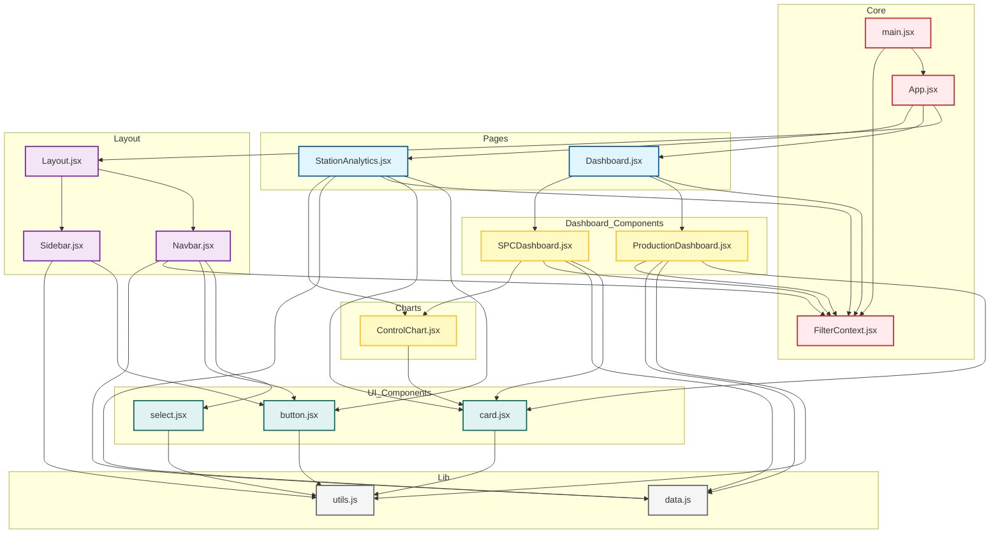

# Repository Dependency Diagram

This diagram visualizes the structure and dependencies of your React application.

## Legend
- **Core Files (Red)**: Entry points and Context providers.
- **Pages (Blue)**: Top-level route components.
- **Layout (Purple)**: Structural components like Layout, Navbar, Sidebar.
- **Components (Yellow)**: Functional widgets (Charts, Dashboards).
- **UI Components (Green)**: Reusable atomic elements (Button, Card).
- **Lib/Utils (Grey)**: Data constants and helper functions.
